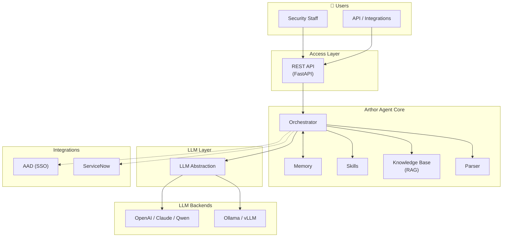
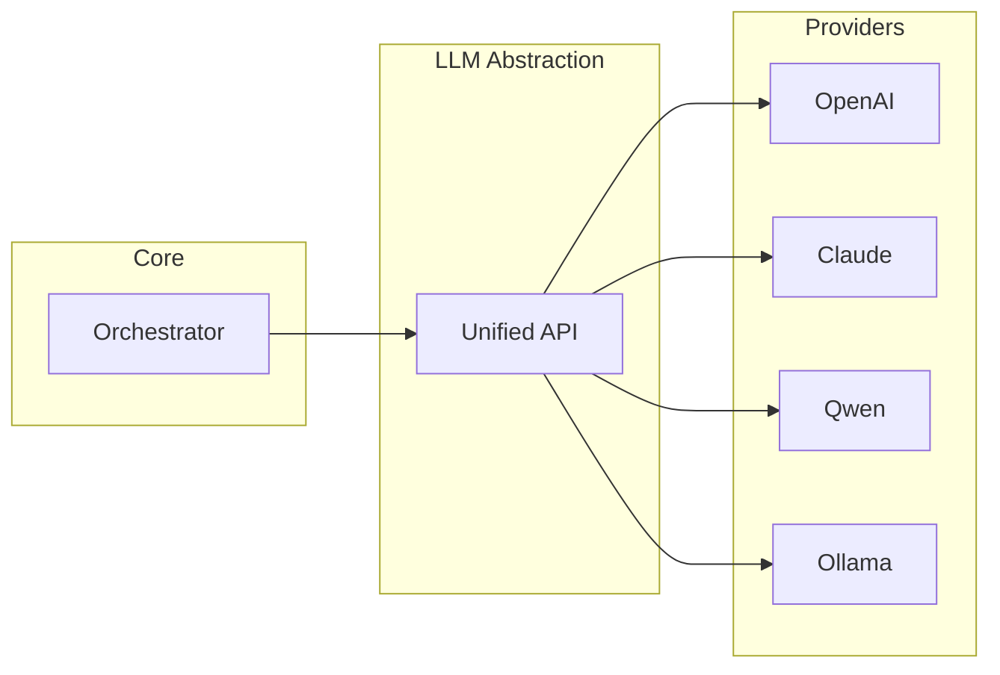
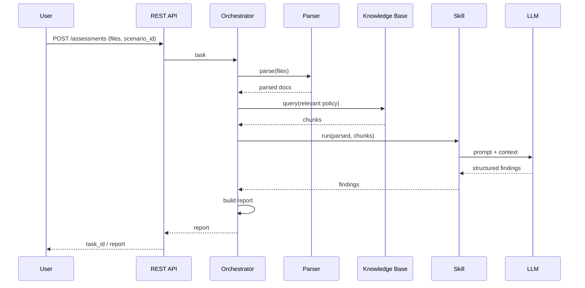
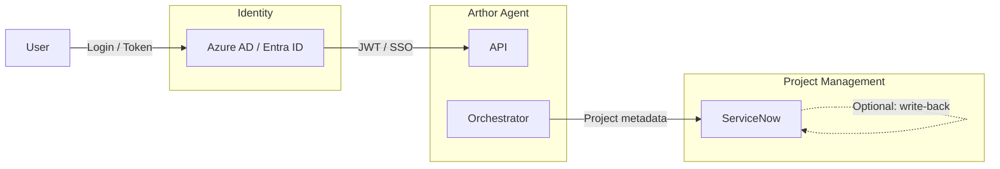
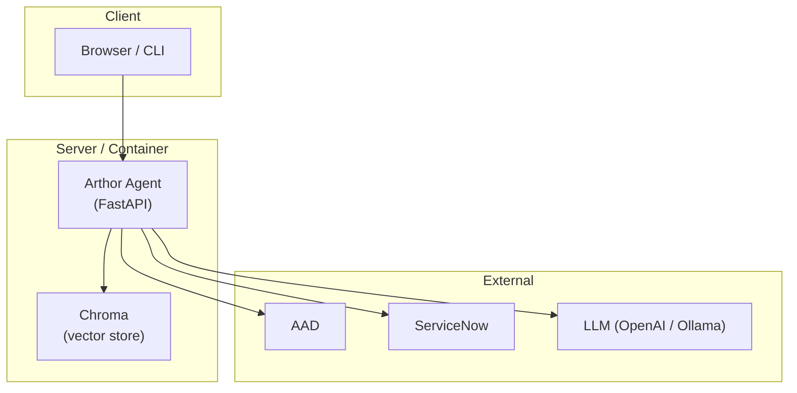

# System Architecture | 系统架构

**Arthor Agent** — System Architecture Document (open-source style)

| | |
|---|---|
| **Version** | 1.0 |
| **Author** | PAN CHAO |
| **Last updated** | 2025-03 |
| **Related** | [Product Requirements (PRD)](./Arthor-Agent-PRD.md) · [Design docs](./docs/README.md) |

---

## Overview | 概述

Arthor Agent is an AI-powered system that automates security assessment of documents, questionnaires, and reports. This document describes the **system architecture**: high-level design, components, data flow, integrations, and deployment. For product goals and requirements, see [Arthor-Agent-PRD.md](./Arthor-Agent-PRD.md).

---

## Goals & Context | 目标与背景

- **Goal**: Reduce manual effort for security teams by automating first-pass assessment of security-related documents (questionnaires, design docs, compliance evidence) and producing structured reports (risks, compliance gaps, remediations).
- **Context**: Enterprise security teams must align with policies, standards, and frameworks (e.g. NIST, OWASP, SOC2) while reviewing many projects per year; the system provides a unified knowledge base (RAG), multi-format parsing, and pluggable LLMs (cloud or local).

---

## High-Level Architecture | 高层架构

The system is organized in layers: **Access** → **Core (Orchestrator, Memory, Skills, Knowledge Base, Parser)** → **LLM abstraction** → **LLM backends**. External integrations (AAD, ServiceNow) connect at the access and orchestration boundaries.

*Figure 1: Architecture overview (see repo `docs/images/architecture-overview.png`)*

### Mermaid: Logical view

---

## Component Design | 组件设计

### 1. Access Layer | 接入层

- **REST API** (FastAPI): authentication (AAD/API Key), request validation, rate limiting, routing to assessment / KB / health.
- **Optional**: Web UI, CLI; future: webhooks for events.

### 2. Orchestrator | 任务编排

- Accepts assessment tasks (files + optional scenario/project ID).
- Coordinates: Parser → Knowledge Base retrieval → Skill(s) → LLM → report assembly.
- Can run multi-step reasoning and read/write Memory.

### 3. Memory | 记忆体

- **Working memory**: current task and session context.
- **Episodic** (optional): session summaries for “compare with last assessment”.
- **Implementation**: in-memory / Redis; optional vector store for semantic recall.

### 4. Skills | 技能层

- Reusable assessment capabilities (e.g. questionnaire vs. policy, evidence check, risk rating).
- Input/output contract (e.g. JSON Schema); orchestrator invokes Skills and aggregates results.

### 5. Knowledge Base (RAG) | 知识库

- **Ingest**: multi-format upload → Parser → chunk → embed → vector store (e.g. Chroma).
- **Query**: RAG retrieval returns relevant chunks for the orchestrator to inject into LLM context.
- Supports multiple collections and metadata filters (e.g. by compliance framework).

### 6. Parser | 文件解析

- Converts uploaded files (PDF, Word, Excel, PPT, text) into a unified format (Markdown/JSON) for the agent and for KB ingestion.
- Uses open-source libs (e.g. PyMuPDF, python-docx, openpyxl); shared pipeline for assessment input and KB documents.

### 7. LLM Abstraction | LLM 抽象层

- Single interface for chat/completion (and optional function calling).
- Plugins: OpenAI, Anthropic, Qwen, **Ollama** (local), etc.; configuration-driven switch.

---

## Data Flow | 数据流

End-to-end flow for an assessment:

1. User submits files (and optional scenario/project ID).
2. **Optional**: Fetch project metadata from ServiceNow for scenario selection and access.
3. **Parser** converts files to a unified format.
4. **Orchestrator** retrieves relevant KB chunks (RAG), invokes **Skill(s)**, calls **LLM** with context.
5. Report (risks, compliance gaps, remediations) is returned or stored for sign-off.

---

## Integration Points | 集成

- **AAD**: SSO and API token validation (OAuth2/OIDC).
- **ServiceNow**: Read project metadata (type, compliance scope, owner); optional write-back of assessment results to tickets.

See [docs/04-integration-guide.md](./docs/04-integration-guide.md) for configuration and field mapping.

---

## Security Architecture | 安全架构

Security is designed along five areas (detailed in [PRD §7.2](./Arthor-Agent-PRD.md)):

| Area | Summary |
|------|---------|
| **Identity & access** | AAD/SSO, RBAC (analyst, lead, project owner, API consumer, admin), token/API key, data isolation by project/role. |
| **Data** | TLS for transport; secrets not in code; minimal retention; optional local-only LLM for data sovereignty. |
| **Application** | Input validation, injection prevention, dependency/SCA, safe error responses, security headers, rate limiting. |
| **Operations** | Audit log (who/what/when), operational logging without sensitive content, alerting, backup and recovery. |
| **Supply chain** | Trusted dependencies, vulnerability handling, license compliance. |

---

## Deployment View | 部署视图

- **Runtime**: Python 3.10+, FastAPI, Uvicorn.
- **Storage**: Vector store (Chroma) persisted on disk or network volume; optional Redis for memory/session.
- **Network**: Outbound to AAD, ServiceNow, and LLM endpoints; TLS recommended for production.
- **Deployment**: Single node / container for MVP; scale out by separating API and worker if needed.

See [docs/05-deployment-runbook.md](./docs/05-deployment-runbook.md) for environment, configuration, and runbook.

---

## References | 参考

| Document | Description |
|----------|-------------|
| [Arthor-Agent-PRD.md](./Arthor-Agent-PRD.md) | Product requirements, pain points, features, security controls. |
| [docs/01-architecture-and-tech-stack.md](./docs/01-architecture-and-tech-stack.md) | Technology choices and module layout. |
| [docs/02-api-specification.yaml](./docs/02-api-specification.yaml) | OpenAPI spec. |
| [docs/03-assessment-report-and-skill-contract.md](./docs/03-assessment-report-and-skill-contract.md) | Report schema and Skill I/O. |
| [docs/04-integration-guide.md](./docs/04-integration-guide.md) | AAD, ServiceNow integration. |
| [docs/05-deployment-runbook.md](./docs/05-deployment-runbook.md) | Deployment and operations. |

---

*This architecture document is part of the [Arthor Agent](https://github.com/arthurpanhku/Arthor-Agent) open-source project.*
