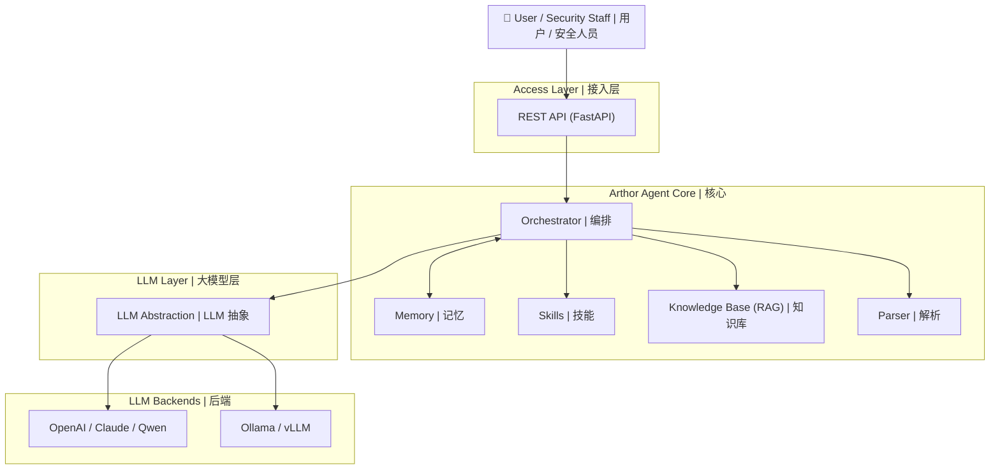
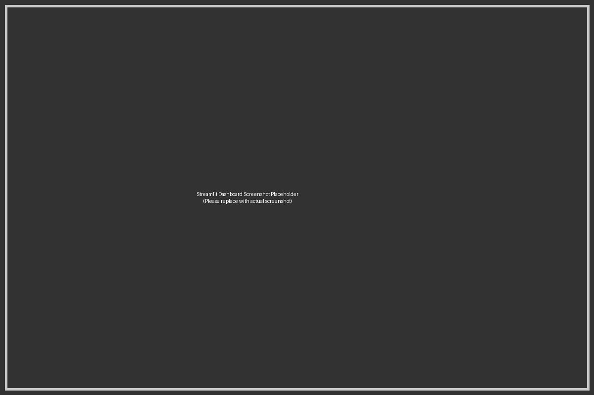
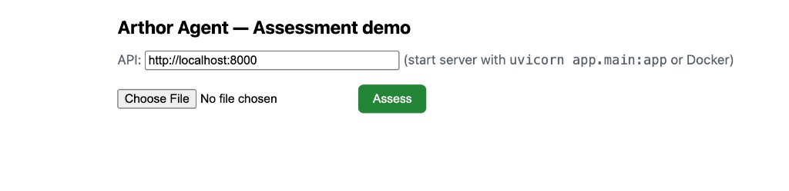

<p align="center">
  
</p>

<p align="center">
  <strong>Arthor Agent</strong><br/>
  <em>Automated security assessment for documents and questionnaires</em><br/>
  <em>面向文档与问卷的自动化安全评估</em>
</p>

<p align="center">
  <a href="https://github.com/arthurpanhku/Arthor-Agent/releases"></a>
  <a href="https://github.com/arthurpanhku/Arthor-Agent/blob/main/LICENSE"></a>
  <a href="https://www.python.org/downloads/"></a>
  <a href="https://github.com/arthurpanhku/Arthor-Agent"></a>
</p>

---

## What is Arthor Agent? | Arthor Agent 是什么？

**中文**

**Arthor Agent** 是面向安全团队的 AI 助手。它自动化审阅与安全相关的**文档、表格和报告**（如安全问卷、设计文档、合规证据），结合策略与知识库进行比对，并产出**结构化评估报告**，包含风险项、合规差距与整改建议。

- **多格式输入**：PDF、Word、Excel、PPT、文本，解析为统一格式供大模型使用。
- **知识库（RAG）**：上传策略与合规文档，评估时作为参考检索。
- **多模型支持**：通过统一接口使用 OpenAI、Claude、千问或 **Ollama**（本地）。
- **结构化输出**：JSON/Markdown 报告，含风险项、合规差距与可执行整改建议。

适合需要在大量项目中扩展安全评估、而人力有限的企业。

**English**

**Arthor Agent** is an AI-powered assistant for security teams. It automates the review of security-related **documents, forms, and reports** (e.g. Security Questionnaires, design docs, compliance evidence), compares them against your policy and knowledge base, and produces **structured assessment reports** with risks, compliance gaps, and remediation suggestions.

- **Multi-format input**: PDF, Word, Excel, PPT, text — parsed into a unified format for the LLM.
- **Knowledge base (RAG)**: Upload policy and compliance documents; the agent uses them as reference when assessing.
- **Multiple LLMs**: Use OpenAI, Claude, Qwen, or **Ollama** (local) via a single interface.
- **Structured output**: JSON/Markdown reports with risk items, compliance gaps, and actionable remediations.

Ideal for enterprises that need to scale security assessments across many projects without proportionally scaling headcount.

---

## Why Arthor Agent? | 为什么用 Arthor Agent？

**中文**

企业安全团队常见痛点与 Arthor Agent 的应对方式：

| 痛点                                                              | Arthor Agent 的应对                                              |
| :---------------------------------------------------------------- | :--------------------------------------------------------------- |
| **评估依据分散**<br>策略、标准与先例散落各处。                    | 统一**知识库**承载策略与控制项，评估一致、可追溯。               |
| **问卷流程繁重**<br>业务填表 → 安全评估 → 业务补证据 → 安全再审。 | **自动化初评**与差距分析，减少多轮往返。                         |
| **上线前审阅压力**<br>安全需审阅并签批大量技术文档。              | **结构化报告**（风险、差距、整改）让审阅聚焦决策，而非逐行阅读。 |
| **规模与一致性**<br>项目多、标准多，人工易不一致或延迟。          | **可配置场景**与统一流水线，保证一致与可审计。                   |

**English**

Enterprise security teams face:

| Pain point                                                                                                                           | How Arthor Agent helps                                                                                       |
| :----------------------------------------------------------------------------------------------------------------------------------- | :----------------------------------------------------------------------------------------------------------- |
| **Fragmented criteria**<br>Policies, standards, and precedents are scattered.                                                        | A single **knowledge base** holds policies and controls; assessments are consistent and traceable.           |
| **Heavy questionnaire workflow**<br>Business fills forms → security evaluates → business provides evidence → security reviews again. | **Automated first-pass assessment** and gap analysis reduce manual rounds.                                   |
| **Pre-release review pressure**<br>Security must review and sign off on many technical documents.                                    | **Structured reports** (risks, gaps, remediations) let reviewers focus on decisions, not reading every line. |
| **Scale vs. consistency**<br>Many projects and standards lead to inconsistent or delayed assessments.                                | **Configurable scenarios** and a unified pipeline keep assessments consistent and auditable.                 |

*完整问题陈述与产品目标见 [SPEC.md](./SPEC.md)（产品需求与规格）。*  
*See the full problem statement and product goals in [SPEC.md](./SPEC.md).*

---

## Architecture | 架构

**中文**

Arthor Agent 以**编排器**为核心，协调解析、知识库（RAG）、技能（如问卷与策略比对）与 LLM。可按环境选用云端或本地大模型，以及可选集成（如 AAD、ServiceNow）。

**English**

Arthor Agent is built around an **orchestrator** that coordinates parsing, the knowledge base (RAG), skills (e.g. questionnaire vs. policy check), and the LLM. You can use cloud or local LLMs and optional integrations (e.g. AAD, ServiceNow) as your environment requires.



**数据流（简要）| Data flow (simplified):**

1.  用户上传文档，可选选择场景或项目。 / User uploads documents and (optionally) selects a scenario or project.
2.  **Parser 解析器**将文件（PDF、Word、Excel、PPT 等）转为统一文本/Markdown。 / **Parser** converts files into a unified text/Markdown format.
3.  **编排器**从**知识库**（RAG）加载相关片段并调用**技能**（如问卷与策略比对）。 / **Orchestrator** loads relevant chunks from the **Knowledge Base** (RAG) and invokes **Skills**.
4.  **LLM**（OpenAI、Ollama 等）生成结构化结论。 / **LLM** produces structured findings.
5.  返回**评估报告**（风险、合规差距、整改建议）。 / The result is returned as an **assessment report** (risks, compliance gaps, remediations).

*详细架构与组件说明见 [ARCHITECTURE.md](./ARCHITECTURE.md) 与 [docs/01-architecture-and-tech-stack.md](./docs/01-architecture-and-tech-stack.md)。*  
*Detailed architecture: [ARCHITECTURE.md](./ARCHITECTURE.md) and [docs/01-architecture-and-tech-stack.md](./docs/01-architecture-and-tech-stack.md).*

---

## Features | 功能概览

**中文**

| 领域           | 能力                                                                                              |
| :------------- | :------------------------------------------------------------------------------------------------ |
| **文档解析**   | Word、PDF、Excel、PPT、文本；输出为 Markdown/JSON 供 LLM 使用。                                   |
| **知识库**     | 多格式上传、分块、向量化（如 Chroma）、RAG 检索。                                                 |
| **评估**       | 提交文件 → 获得结构化报告（风险项、合规差距、整改建议）。                                         |
| **LLM**        | 可配置提供商：**Ollama**（本地）、OpenAI 等。                                                     |
| **API**        | REST：提交评估、获取结果、上传/查询知识库、健康检查。                                             |
| **安全与合规** | 安全需求与控制（身份、数据、应用、运维）见 [SPEC §7.2](./SPEC.md)；[SECURITY.md](./SECURITY.md)。 |

路线图（如 AAD/SSO、ServiceNow、RBAC）见 [SPEC.md](./SPEC.md)。

**English**

| Area                      | Capabilities                                                                                                                       |
| :------------------------ | :--------------------------------------------------------------------------------------------------------------------------------- |
| **Document parsing**      | Word, PDF, Excel, PPT, text; output as Markdown/JSON for the LLM.                                                                  |
| **Knowledge base**        | Multi-format upload, chunking, embedding (e.g. Chroma), RAG query.                                                                 |
| **Assessment**            | Submit files → get structured report (risk items, compliance gaps, remediations).                                                  |
| **LLM**                   | Configurable provider: **Ollama** (local), OpenAI, or others via abstraction layer.                                                |
| **API**                   | REST: submit assessment, get result, upload to KB, query KB, health.                                                               |
| **Security & compliance** | Security requirements and controls (identity, data, application, ops) in [SPEC §7.2](./SPEC.md); see [SECURITY.md](./SECURITY.md). |

Roadmap (e.g. AAD/SSO, ServiceNow, RBAC): [SPEC.md](./SPEC.md).

---

## Quick Start | 快速开始

� **New Streamlit Frontend**:
Run the modern dashboard for a full experience:

```bash
pip install streamlit plotly pandas
streamlit run frontend/Home.py
```


*Dashboard view*


*Assessment Workbench view*

### Legacy Demo (Optional)
�📹 **演示界面**：启动 API 后打开 [docs/demo.html](docs/demo.html)，选择文件并点击 Assess 即可获得评估报告。



*录制 30 秒 GIF*：按上述操作录屏，保存为 `docs/images/demo-assessment.gif`。详见 [docs/DEMO-RECORD.md](docs/DEMO-RECORD.md)。

### Option A: Docker（推荐）| Docker (recommended)

**中文**

**前置**：已安装 [Docker](https://docs.docker.com/get-docker/) 与 [Docker Compose](https://docs.docker.com/compose/install/)。

仅启动 API（使用 OpenAI 或本机已运行的 Ollama）：

```bash
git clone https://github.com/arthurpanhku/Arthor-Agent.git
cd Arthor-Agent
docker compose up -d
```

需要连同 **Ollama 容器** 一起启动时：

```bash
docker compose -f docker-compose.yml -f docker-compose.ollama.yml up -d
docker compose exec ollama ollama pull llama2
```

-   **API 文档（Swagger）**：[http://localhost:8000/docs](http://localhost:8000/docs)
-   **健康检查**：[http://localhost:8000/health](http://localhost:8000/health)

**English**

**Prerequisites**: [Docker](https://docs.docker.com/get-docker/) and [Docker Compose](https://docs.docker.com/compose/install/).

API only (use OpenAI or Ollama on host):

```bash
git clone https://github.com/arthurpanhku/Arthor-Agent.git
cd Arthor-Agent
docker compose up -d
```

With **Ollama in Docker**:

```bash
docker compose -f docker-compose.yml -f docker-compose.ollama.yml up -d
docker compose exec ollama ollama pull llama2
```

-   **API docs (Swagger)**: [http://localhost:8000/docs](http://localhost:8000/docs)
-   **Health**: [http://localhost:8000/health](http://localhost:8000/health)

---

### Option B: Python（本地开发）| Python (local dev)

**中文**

**前置**：**Python 3.10+**。可选 [Ollama](https://ollama.ai) 作为本地 LLM（`ollama pull llama2`）。

```bash
git clone https://github.com/arthurpanhku/Arthor-Agent.git
cd Arthor-Agent
python3 -m venv .venv
source .venv/bin/activate   # Windows: .venv\Scripts\activate
pip install -r requirements.txt
cp .env.example .env        # 按需编辑：LLM_PROVIDER=ollama 或 openai
uvicorn app.main:app --reload --host 0.0.0.0 --port 8000
```

-   **API 文档**：[http://localhost:8000/docs](http://localhost:8000/docs) · **健康检查**：[http://localhost:8000/health](http://localhost:8000/health)

**English**

**Prerequisites**: **Python 3.10+**. Optional: [Ollama](https://ollama.ai) for local LLM (`ollama pull llama2`).

```bash
git clone https://github.com/arthurpanhku/Arthor-Agent.git
cd Arthor-Agent
python3 -m venv .venv
source .venv/bin/activate   # Windows: .venv\Scripts\activate
pip install -r requirements.txt
cp .env.example .env       # Edit if needed: LLM_PROVIDER=ollama or openai
uvicorn app.main:app --reload --host 0.0.0.0 --port 8000
```

-   **API docs**: [http://localhost:8000/docs](http://localhost:8000/docs) · **Health**: [http://localhost:8000/health](http://localhost:8000/health)

---

### 示例：提交评估 | Example: submit an assessment

可使用仓库内 [examples/](examples/) 下的示例文件快速试跑。
You can use the sample files in [examples/](examples/) to try the API.

```bash
# 使用示例文本 / Use sample file from repo
curl -X POST "http://localhost:8000/api/v1/assessments" \
  -F "files=@examples/sample.txt" \
  -F "scenario_id=default"

# 响应：{ "task_id": "...", "status": "accepted" } — 用返回的 task_id 查询结果
# Get the result (replace TASK_ID with the returned task_id)
curl "http://localhost:8000/api/v1/assessments/TASK_ID"
```

### 示例：上传知识库并检索 | Example: upload to KB and query

```bash
# 使用示例策略文件 / Use sample policy from repo
curl -X POST "http://localhost:8000/api/v1/kb/documents" -F "file=@examples/sample-policy.txt"

# 检索（RAG）/ Query the KB (RAG)
curl -X POST "http://localhost:8000/api/v1/kb/query" \
  -H "Content-Type: application/json" \
  -d '{"query": "What are the access control requirements?", "top_k": 5}'
```

---

## Project layout | 项目结构

```text
Arthor-Agent/
├── app/                  # 应用代码
│   ├── api/              # REST 路由：评估、知识库、健康检查
│   ├── agent/            # 编排与评估流水线
│   ├── core/             # 配置 (pydantic-settings)
│   ├── kb/               # 知识库 (Chroma, 分块, RAG)
│   ├── llm/              # LLM 抽象 (OpenAI, Ollama)
│   ├── parser/           # 文档解析 (PDF, Word, Excel, PPT, 文本)
│   ├── models/           # Pydantic 模型
│   └── main.py
├── tests/                # 自动化测试 (pytest)
├── examples/             # 示例文件（问卷、策略样本）
├── docs/                 # 设计与规格文档
│   ├── 01-architecture-and-tech-stack.md
│   ├── 02-api-specification.yaml
│   ├── 03-assessment-report-and-skill-contract.md
│   ├── 04-integration-guide.md
│   ├── 05-deployment-runbook.md
│   └── schemas/
├── .github/              # Issue/PR 模板、CI (Actions)
├── Dockerfile
├── docker-compose.yml    # 仅 API
├── docker-compose.ollama.yml  # API + Ollama 可选
├── CONTRIBUTING.md       # 贡献指南
├── CODE_OF_CONDUCT.md    # 行为准则
├── CHANGELOG.md
├── SPEC.md
├── LICENSE
├── SECURITY.md
├── requirements.txt
├── requirements-dev.txt  # 测试与开发依赖
├── pytest.ini
└── .env.example
```

---

## Configuration | 配置

| 变量 Variable                                  | 说明 Description     | 默认 Default                        |
| :--------------------------------------------- | :------------------- | :---------------------------------- |
| `LLM_PROVIDER`                                 | `ollama` 或 `openai` | `ollama`                            |
| `OLLAMA_BASE_URL` / `OLLAMA_MODEL`             | 本地 LLM             | `http://localhost:11434` / `llama2` |
| `OPENAI_API_KEY` / `OPENAI_MODEL`              | OpenAI               | —                                   |
| `CHROMA_PERSIST_DIR`                           | 向量库路径           | `./data/chroma`                     |
| `UPLOAD_MAX_FILE_SIZE_MB` / `UPLOAD_MAX_FILES` | 上传限制             | `50` / `10`                         |

*完整选项见 [.env.example](./.env.example) 与 [docs/05-deployment-runbook.md](./docs/05-deployment-runbook.md)。*  
*See [.env.example](./.env.example) and [docs/05-deployment-runbook.md](./docs/05-deployment-runbook.md) for full options.*

---

## Documentation and PRD | 文档与规格

**中文**

-   **[ARCHITECTURE.md](./ARCHITECTURE.md)** — 系统架构：高层图、Mermaid 视图（逻辑/组件/时序/集成/部署）、组件设计、数据流、安全架构。
-   **[SPEC.md](./SPEC.md)** — 产品需求与规格：问题陈述、方案、架构摘要、功能、安全控制与开放问题。
-   **[CHANGELOG.md](./CHANGELOG.md)** — 版本历史；[Releases](https://github.com/arthurpanhku/Arthor-Agent/releases) 发布说明。
-   **设计文档** [docs/](./docs/)：架构与技术栈、API 规范（OpenAPI）、评估报告与 Skill 契约、集成指南（AAD、ServiceNow）、部署手册。Q1 发布清单：[docs/LAUNCH-CHECKLIST.md](./docs/LAUNCH-CHECKLIST.md)。

**English**

-   **[ARCHITECTURE.md](./ARCHITECTURE.md)** — System architecture: high-level diagram, Mermaid views (logical, component, sequence, integration, deployment), component design, data flow, security architecture.
-   **[SPEC.md](./SPEC.md)** — Product requirements: problem statement, solution, architecture summary, features, security controls, and open questions for development.
-   **[CHANGELOG.md](./CHANGELOG.md)** — Version history; [Releases](https://github.com/arthurpanhku/Arthor-Agent/releases) for release notes.
-   **Design docs** in [docs/](./docs/): architecture and tech stack, API spec (OpenAPI), assessment report and Skill contract, integration guide (AAD, ServiceNow), deployment runbook. Q1 launch: [docs/LAUNCH-CHECKLIST.md](./docs/LAUNCH-CHECKLIST.md).

---

## Contributing | 参与贡献

**中文**：欢迎提交 Issue 与 Pull Request。请先阅读 [CONTRIBUTING.md](CONTRIBUTING.md) 了解开发环境、测试与提交规范。参与即视为同意 [CODE_OF_CONDUCT.md](CODE_OF_CONDUCT.md) 行为准则。

**English**: Issues and Pull Requests are welcome. Please read [CONTRIBUTING.md](CONTRIBUTING.md) for setup, tests, and commit guidelines. By participating you agree to the [CODE_OF_CONDUCT.md](CODE_OF_CONDUCT.md).

---

## Security | 安全

**中文**

-   **漏洞报告**：负责任披露请见 [SECURITY.md](./SECURITY.md)。
-   **安全需求**：项目遵循 [SPEC §7.2](./SPEC.md) 中定义的安全控制（身份、数据保护、应用安全、运维、供应链）。

**English**

-   **Vulnerability reporting**: See [SECURITY.md](./SECURITY.md) for how to report issues responsibly.
-   **Security requirements**: The project follows the security controls defined in [SPEC §7.2](./SPEC.md) (identity, data protection, application security, operations, supply chain).

---

## License | 许可证

本项目采用 **MIT License**，详见 [LICENSE](./LICENSE) 文件。  
This project is licensed under the **MIT License** — see the [LICENSE](./LICENSE) file for details.

---

## Author and links | 作者与链接

-   **作者 Author**: PAN CHAO (Arthur Pan)
-   **仓库 Repository**: [github.com/arthurpanhku/Arthor-Agent](https://github.com/arthurpanhku/Arthor-Agent)
-   **规格与设计文档 SPEC and design docs**: 见上文链接。See links above.

**中文**：若你在组织中使用 Arthor Agent 或希望参与贡献，欢迎通过 GitHub Discussions 或 Issues 联系我们。  
**English**: If you use Arthor Agent in your organization or contribute back, we’d love to hear from you (e.g. via GitHub Discussions or Issues).
