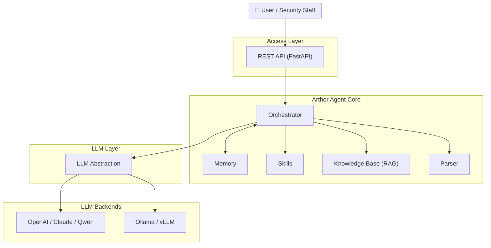

<p align="center">
  
</p>

<p align="center">
  <strong>Arthor Agent</strong><br/>
  <em>Automated security assessment for documents and questionnaires</em>
</p>

<p align="center">
  <a href="https://github.com/arthurpanhku/Arthor-Agent/blob/main/LICENSE"></a>
  <a href="https://www.python.org/downloads/"></a>
  <a href="https://github.com/arthurpanhku/Arthor-Agent"></a>
</p>

---

## What is Arthor Agent?

**Arthor Agent** is an AI-powered assistant for security teams. It automates the review of security-related **documents, forms, and reports** (e.g. Security Questionnaires, design docs, compliance evidence), compares them against your policy and knowledge base, and produces **structured assessment reports** with risks, compliance gaps, and remediation suggestions.

- **Multi-format input**: PDF, Word, Excel, PPT, text — parsed into a unified format for the LLM.
- **Knowledge base (RAG)**: Upload policy and compliance documents; the agent uses them as reference when assessing.
- **Multiple LLMs**: Use OpenAI, Claude, Qwen, or **Ollama** (local) via a single interface.
- **Structured output**: JSON/Markdown reports with risk items, compliance gaps, and actionable remediations.

Ideal for enterprises that need to scale security assessments across many projects without proportionally scaling headcount.

---

## Why Arthor Agent?

Enterprise security teams face:

| Pain point | How Arthor Agent helps |
|------------|------------------------|
| **Fragmented criteria** — Policies, standards, and precedents are scattered. | A single **knowledge base** holds policies and controls; assessments are consistent and traceable. |
| **Heavy questionnaire workflow** — Business fills forms → security evaluates → business provides evidence → security reviews again. | **Automated first-pass assessment** and gap analysis reduce manual rounds. |
| **Pre-release review pressure** — Security must review and sign off on many technical documents. | **Structured reports** (risks, gaps, remediations) let reviewers focus on decisions, not reading every line. |
| **Scale vs. consistency** — Many projects and standards lead to inconsistent or delayed assessments. | **Configurable scenarios** and a unified pipeline keep assessments consistent and auditable. |

*See the full problem statement and product goals in the [Product Requirements Document (PRD)](./Arthor-Agent-PRD.md).*

---

## Architecture

Arthor Agent is built around an **orchestrator** that coordinates parsing, the knowledge base (RAG), skills (e.g. questionnaire vs. policy check), and the LLM. You can use cloud or local LLMs and optional integrations (e.g. AAD, ServiceNow) as your environment requires.



**Data flow (simplified):**

1. User uploads documents and (optionally) selects a scenario or project.
2. **Parser** converts files (PDF, Word, Excel, PPT, etc.) into a unified text/Markdown format.
3. **Orchestrator** loads relevant chunks from the **Knowledge Base** (RAG) and invokes **Skills** (e.g. questionnaire vs. policy comparison).
4. **LLM** (OpenAI, Ollama, etc.) produces structured findings.
5. The result is returned as an **assessment report** (risks, compliance gaps, remediations).

Detailed architecture and component descriptions are in [ARCHITECTURE.md](./ARCHITECTURE.md) and [docs/01-architecture-and-tech-stack.md](./docs/01-architecture-and-tech-stack.md).

---

## Features (from PRD)

| Area | Capabilities |
|------|----------------|
| **Document parsing** | Word, PDF, Excel, PPT, text; output as Markdown/JSON for the LLM. |
| **Knowledge base** | Multi-format upload, chunking, embedding (e.g. Chroma), RAG query. |
| **Assessment** | Submit files → get structured report (risk items, compliance gaps, remediations). |
| **LLM** | Configurable provider: **Ollama** (local), OpenAI, or others via abstraction layer. |
| **API** | REST: submit assessment, get result, upload to KB, query KB, health. |
| **Security & compliance** | Security requirements and controls (identity, data, application, ops) defined in [PRD §7.2](./Arthor-Agent-PRD.md); see [SECURITY.md](./SECURITY.md). |

Roadmap (e.g. AAD/SSO, ServiceNow integration, RBAC) is described in the [PRD](./Arthor-Agent-PRD.md).

---

## Quick Start

### Prerequisites

- **Python 3.10+**
- (Optional) **Ollama** for a local LLM: [install Ollama](https://ollama.ai), then e.g. `ollama pull llama2`

### Install and run

```bash
# Clone the repository
git clone https://github.com/arthurpanhku/Arthor-Agent.git
cd Arthor-Agent

# Create virtual environment and install dependencies
python3 -m venv .venv
source .venv/bin/activate   # On Windows: .venv\Scripts\activate
pip install -r requirements.txt

# Configure environment (copy and edit)
cp .env.example .env
# Set LLM_PROVIDER=ollama (default) or openai, and API keys if using cloud LLM.

# Run the API server
uvicorn app.main:app --reload --host 0.0.0.0 --port 8000
```

- **API docs (Swagger)**: [http://localhost:8000/docs](http://localhost:8000/docs)  
- **Health**: [http://localhost:8000/health](http://localhost:8000/health)

### Example: submit an assessment

```bash
# Submit one or more documents (e.g. a PDF and an Excel questionnaire)
curl -X POST "http://localhost:8000/api/v1/assessments" \
  -F "files=@questionnaire.xlsx" \
  -F "files=@architecture.pdf" \
  -F "scenario_id=default"

# Response: { "task_id": "...", "status": "accepted" }

# Get the result (replace TASK_ID with the returned task_id)
curl "http://localhost:8000/api/v1/assessments/TASK_ID"
```

### Example: upload to knowledge base and query

```bash
# Upload a policy document to the KB
curl -X POST "http://localhost:8000/api/v1/kb/documents" -F "file=@security-policy.pdf"

# Query the KB (RAG)
curl -X POST "http://localhost:8000/api/v1/kb/query" \
  -H "Content-Type: application/json" \
  -d '{"query": "What are the access control requirements?", "top_k": 5}'
```

---

## Project layout

```
Arthor-Agent/
├── app/
│   ├── api/          # REST routes: assessments, KB, health
│   ├── agent/        # Orchestrator and assessment pipeline
│   ├── core/         # Config (pydantic-settings)
│   ├── kb/           # Knowledge base (Chroma, chunking, RAG)
│   ├── llm/          # LLM abstraction (OpenAI, Ollama)
│   ├── parser/       # Document parsing (PDF, Word, Excel, PPT, text)
│   ├── models/       # Pydantic models (report, parsed doc)
│   └── main.py       # FastAPI application
├── docs/             # Design and specification
│   ├── 01-architecture-and-tech-stack.md
│   ├── 02-api-specification.yaml
│   ├── 03-assessment-report-and-skill-contract.md
│   ├── 04-integration-guide.md
│   ├── 05-deployment-runbook.md
│   └── schemas/
├── Arthor-Agent-PRD.md   # Product requirements (full)
├── LICENSE               # MIT
├── SECURITY.md           # Security policy and disclosure
├── requirements.txt
└── .env.example
```

---

## Configuration

| Variable | Description | Default |
|----------|-------------|---------|
| `LLM_PROVIDER` | `ollama` or `openai` | `ollama` |
| `OLLAMA_BASE_URL` / `OLLAMA_MODEL` | For local LLM | `http://localhost:11434` / `llama2` |
| `OPENAI_API_KEY` / `OPENAI_MODEL` | For OpenAI | — |
| `CHROMA_PERSIST_DIR` | Vector store path | `./data/chroma` |
| `UPLOAD_MAX_FILE_SIZE_MB` / `UPLOAD_MAX_FILES` | Upload limits | `50` / `10` |

See [.env.example](./.env.example) and [docs/05-deployment-runbook.md](./docs/05-deployment-runbook.md) for full options.

---

## Documentation and PRD

- **[ARCHITECTURE.md](./ARCHITECTURE.md)** — System architecture: high-level diagram, Mermaid views (logical, component, sequence, integration, deployment), component design, data flow, security architecture.
- **[Arthor-Agent-PRD.md](./Arthor-Agent-PRD.md)** — Product requirements: problem statement, solution, architecture summary, features, security controls, and open questions for development.
- **Design docs** in [docs/](./docs/): architecture and tech stack, API spec (OpenAPI), assessment report and Skill contract, integration guide (AAD, ServiceNow), deployment runbook.

---

## Security

- **Vulnerability reporting**: See [SECURITY.md](./SECURITY.md) for how to report issues responsibly.
- **Security requirements**: The project follows the security controls defined in [PRD §7.2](./Arthor-Agent-PRD.md) (identity, data protection, application security, operations, supply chain).

---

## License

This project is licensed under the **MIT License** — see the [LICENSE](./LICENSE) file for details.

---

## Author and links

- **Author**: PAN CHAO (Arthur Pan)  
- **Repository**: [github.com/arthurpanhku/Arthor-Agent](https://github.com/arthurpanhku/Arthor-Agent)  
- **PRD and design docs**: See links above.

If you use Arthor Agent in your organization or contribute back, we’d love to hear from you (e.g. via GitHub Discussions or Issues).
